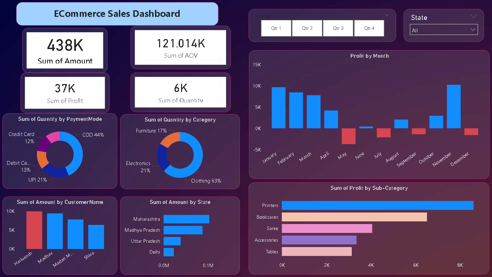

# 🛒 PowerBI Ecommerce Sales Dashboard

## 📌 Project Overview
This project is an interactive Ecommerce Sales Dashboard developed using Power BI to analyze overall sales performance, profit trends, customer behavior, payment methods, and state-wise sales distribution.

The dashboard helps businesses gain valuable insights into revenue generation, profit contribution, customer purchasing patterns, and product category performance through interactive visualizations.

---

# 📊 Dashboard Preview



---

# ✨ Key Features

- 📍 Interactive quarterly and state-wise filtering
- 📈 KPI cards for:
  - 💰 Total Sales Amount
  - 🧾 Average Order Value (AOV)
  - 📊 Total Profit
  - 📦 Total Quantity Sold
- 📅 Monthly profit trend analysis
- 🛍️ Category-wise quantity distribution
- 💳 Payment mode analysis
- 👥 Customer-wise sales comparison
- 🌍 State-wise sales performance
- 📌 Sub-category profit analysis

---

# 📈 Business Insights

## 💵 Sales Overview
- 💰 Total Sales Amount reached **438K**
- 🧾 Average Order Value (AOV) recorded at **121K**
- 📊 Overall Profit generated was **37K**
- 📦 Total Quantity Sold was **6K**

## 🛍️ Category Analysis
- 👕 Clothing contributed the highest quantity sales
- 💻 Electronics and 🪑 Furniture followed behind Clothing

## 💳 Payment Analysis
- 💵 COD (Cash on Delivery) was the most preferred payment mode
- 📱 UPI and 💳 Debit/Credit Cards also contributed significantly

## 📅 Monthly Profit Trends
- 🚀 Highest profit observed during **November**
- ❌ Negative profit months identified:
  - May
  - July
  - September
  - December

## 🌍 Regional Analysis
- 📍 Maharashtra generated the highest sales amount
- 📍 Madhya Pradesh and Uttar Pradesh also contributed significantly

## 📦 Product Insights
- 🖨️ Printers generated the highest profit among sub-categories
- 📚 Bookcases and 👗 Sarees also showed strong performance

---

# 🛠️ Tools & Technologies Used

- 📊 Power BI
- ⚡ DAX
- 📈 Data Visualization
- 🧹 Data Cleaning
- 📂 Excel / CSV Dataset

---

# 🧩 Dashboard Components

| 📌 Component | 📖 Description |
|---|---|
| KPI Cards | Displays overall business metrics |
| Donut Charts | Payment mode & category analysis |
| Bar Charts | State-wise and customer-wise analysis |
| Profit Trend Chart | Monthly profit visualization |
| Filters/Slicers | Quarter and State-based filtering |

---

# 📁 Files Included

```text
Dashboard/
│── Ecommerce_Sales_Dashboard.pbix

Dataset/
│── Details.csv
│── Orders.csv

Screenshots/
│── Dashboard-overview.png
